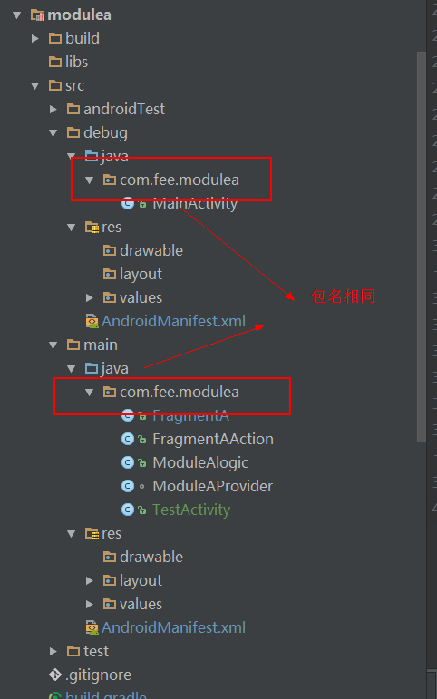

# 模块化项目实践
## 解决的问题
* 单独模块可以单独运行，解决编译项目时间过长问题
* 模块间通信问题

### 如何解决模块间通信
使用了第三方库

`compile 'com.spinytech.ma:macore:0.2.1'
`

[https://github.com/SpinyTech/ModularizationArchitecture](https://github.com/SpinyTech/ModularizationArchitecture)

[Android架构思考(模块化、多进程)](http://blog.spinytech.com/2016/12/28/android_modularization/)

### 单独模块单独编译的问题
1. 项目根目录下创建一个配置文件 `common_config.gradle`

    ```
    project.ext {
        compilesSdkVersion =25
        buildToolVersion = "25.0.3"
        minSdkVersion = 15
        targetSdkVersion = 25
        applicationId = "com.fee.moduleprojectdemo"
        supportLibVersion = "25.3.1"
    
        //模块是否单独运行
        isModuleDebug = false
    
    }
    ```

2. 每个模块的 `build.gradle` 文件中都加入该配置文件，统一配置项目的基础参数，详情见 demo
    ```
    apply from: "${rootProject.rootDir}/common_config.gradle"
    ```

3. 对于要单独运行的模块做以下操作
    1. 创建 debug 文件夹
        
        
    
    2. 创建一个Activity 作为单独运行时程序的入口
    ```
        public class MainActivity extends AppCompatActivity {
        
            @Override
            protected void onCreate(Bundle savedInstanceState) {
                super.onCreate(savedInstanceState);
                FrameLayout frameLayout = new FrameLayout(this);
                FrameLayout.LayoutParams layoutParams = new FrameLayout.LayoutParams(
                        FrameLayout.LayoutParams.MATCH_PARENT, FrameLayout.LayoutParams.MATCH_PARENT);
                frameLayout.setId(R.id.action_container);
                setContentView(frameLayout,layoutParams);
                //setContentView(R.layout.activity_main);
                getSupportFragmentManager().beginTransaction()
                        .add(R.id.action_container, new FragmentA())
                .commit();
            }
        }
    
    ```
    3. debug 文件夹下 配置 AndroidManifest.xml
    ```
        <application
            android:allowBackup="true"
            android:label="@string/app_name"
            android:supportsRtl="true"
            android:theme="@style/AppTheme">
            <activity android:name=".MainActivity">
                <intent-filter>
                    <action android:name="android.intent.action.MAIN"/>
    
                    <category android:name="android.intent.category.LAUNCHER"/>
                </intent-filter>
            </activity>
            <activity android:name=".TestActivity">
            </activity>
        </application>
    ```
    
    
    
    2. 在该模块的 `build.gradle` 文件中加入如下代码
        ```
        if (project.ext.isModuleDebug) {
            apply plugin: 'com.android.application'
        } else {
            apply plugin: 'com.android.library'
        }
        android{
            ....
            sourceSets {
                    main {
                        if (project.ext.isModuleDebug) {
                            manifest.srcFile 'src/debug/AndroidManifest.xml'
            
                        } else {
                            manifest.srcFile 'src/main/AndroidManifest.xml'
                            java {
                                //排除java/debug文件夹下的所有文件
                                exclude 'src/debug/**'
                            }
                        }
                    }
                }
        }
        
        ```
     3. 主模块中加入以下代码：
          build.gradle 中
          
          ```
          buildTypes {
                  debug{
                      buildConfigField("boolean","isModuleDebug","${project.ext.isModuleDebug}")
                      ....
                  }
                  release {
                      buildConfigField("boolean","isModuleDebug","${project.ext.isModuleDebug}")
                      .....
                  }
              }
              
              
              
           dependencies {
               if (!project.ext.isModuleDebug) {
                   compile project(':modulea')
                   compile project(':moduleb')
               }
               .....
           }   
              
              
          ```
         
        MyApplication 中
        ```
        if (!BuildConfig.isModuleDebug) {
                    registerApplicationLogic("com.fee.moduleprojectdemo", 998, ModuleAlogic.class);
                    registerApplicationLogic("com.fee.moduleprojectdemo", 998, ModuleBlogic.class);
        }
        ```

4. 现在就可以单独运行某个模块了，修改 common_config.gradle 中的
isModuleDebug 的值就可以随时切换是单独运行模块还是整合到一起运行了。
       
#### 注意：
在可以运行模块的时候，也就是当独运行模块时，如果创建 Activity 、service等都需要在两个 AndroidManifests 文件
注册，debug 下添加是为了 模块 单独运行，main 下添加是为了能整个项目能运行

运行命令 `gradlew findbugs` 可以查看测试报告具体见文章[http://blog.csdn.net/it_talk/article/details/50420581](http://blog.csdn.net/it_talk/article/details/50420581)